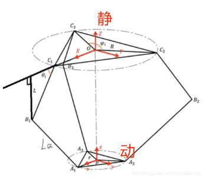

# MTI战队 电控方案开源

# 前言
  我们在研究了排球赛规则后采用了Delta三轴机械臂的方案，故使用此解算程序来计算机械臂动平面中心在不同的三维坐标下对应的各个并联轴的主臂角度。
  本代码在[此处](https://github.com/Enecell/CURC-Robocon2025-Volleyball_FJUT)开源,在闲鱼购买请联系原作者LL3323126216@163.com+
  另外，本代码参考b站up主[革命的草鞋](https://space.bilibili.com/389803222?spm_id_from=333.788.upinfo.head.click)编写，无明确许可证。请勿用于商业用途。

# 功能综述
  文件中work.py用于初步计算机械臂动平面大致需要的工作空间，solution.c用于计算动平面中心在不同坐标下的各个并联臂主臂的角度。
  
# 代码解析

使用教学：
首先找到这里
  ```
work.py

#根据自己的机械尺寸修改相应的变量
#示例数据
R = 120 #静平面半径
r = 110 #动平面半径
L = 180#主动臂长度
La = 200 #从动臂长度

  ```


根据图片上的指引，输入对应的数据

然后，找到此处，在两种作图方案里选择一种运行
  ```
work.py

#建议单次运行只启动其中一种作图程序，将另一端程序注释掉

#三位工作空间图
'''ax = fig.add_subplot(projection='3d')
ax.set_top_view()
for item in theta_1_:
    x, y, z = Delta_works(item, theta23, theta32)
    ax.plot_surface(x, y, z, rstride=1, cstride=1, cmap='rainbow')
    ax.set_xlabel('x')
    ax.set_ylabel('y')
    ax.set_zlabel('z')
plt.show()'''

#二维工作空间图
ax = fig.add_subplot()
for item in theta_1_:
    x, y, z = Delta_works(item, theta23, theta32)
    ax.plot(y, z, )
    ax.set_xlabel('y')
    ax.set_ylabel('z')
    ax.grid(True)
plt.show()
  ```

等待生成工作空间图片


以下为示例工作空间图片


由于我们需求的动平台与静平台的关系与数学模型中的delta机械臂相反，所以在坐标图上呈现的图像是向z轴的负方向延申，也就是说，在z轴负方向上的坐标越大，在实际中的击球盘动平面中心点运动得越高。

考虑到结构的安全和稳定问题，建议对计算出的工作空间进行限制，略微缩小一些工作空间以保证机械臂的安全运行。


接着找到这里


```
solution.c

//直接在此处设定你的机械数据，然后运行
//示例数据
double R=20;//静平面半径
double r=30;//动平面半径
double L=180;//主臂长度
double La=200;//从臂长度

```
在此处修改参数，与刚才的步骤一致

直接运行

